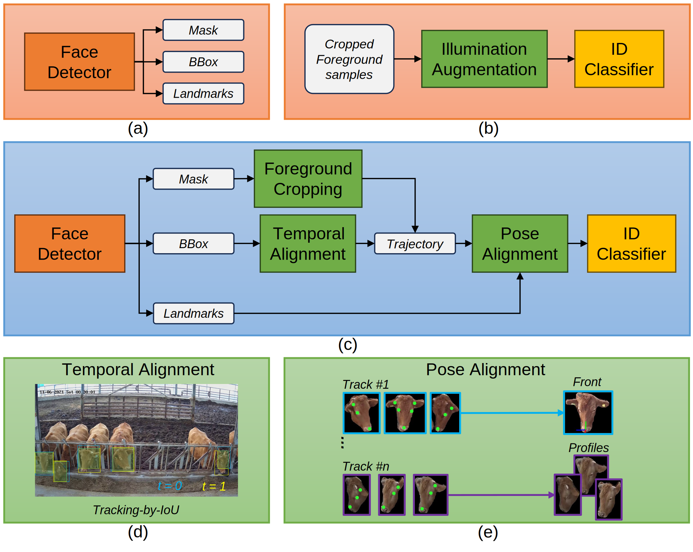

<!--
 * @Date: 2024-11-20 00:00:29
 * @LastEditors: Shujie Han
 * @LastEditTime: 2025-03-18 23:34:52
-->

# Utilizing Farm Knowledge for Indoor Precision Livestock Farming: Time-Domain Adaptation of Cattle Face Recognition

This repository contains the source code for the paper "Utilizing Farm Knowledge for Indoor Precision Livestock Farming: Time-Domain Adaptation of Cattle Face Recognition". The study leverages data augmentation and farm knowledge to improve cattle face recognition in indoor farming environments.

---

## License

This project is licensed under the **GPL-3.0** License. See the [LICENSE](LICENSE) file for details.

### Third-Party Libraries

This project utilizes the following third-party libraries:

- **YOLOv7**: Licensed under GPL-3.0. [Repository](https://github.com/WongKinYiu/yolov7/tree/pose)
- **MMCV**: Licensed under Apache-2.0. [Repository](https://github.com/open-mmlab/mmcv)
- **InsightFace**: Licensed under MIT. [Repository](https://github.com/deepinsight/insightface)


## Overview

1. **Time-Domain Adaptation:** Introduced a novel approach to adapt cattle face recognition models to changing environments.
2. **Farm Knowledge Integration:** Integrated specific knowledge from farm management to enhance recognition accuracy.
3. **Precision Livestock Farming:** Demonstrated the practical application in monitoring cattle in controlled environments.

### Key Visuals:
- **Model Architecture:**  
  

- **Results Demonstration:**  
  

---

## Getting Started

### Prerequisites
- **Python**: 3.8 or higher
- **Libraries**: Install the dependencies using the following command:
  ```bash
  pip install -r requirements.txt
  ```

### Running the Code
1. **Inference**:
   ```bash
   python CompleteInferenceFlow.py
   ```

2. **Train**:
  For a customized cattle face dataset, you may need to train your own model. For details, see the library called by each module.

## Acknowledgment

We sincerely appreciate the contributions of the following open-source projects, which have greatly facilitated the development of this work:

YOLOv7 Pose for its advanced object detection capabilities.

MMCV for providing essential tools and frameworks for deep learning applications.

InsightFace for its outstanding contributions to face recognition and alignment.

Their valuable work has been instrumental in building this project, and we extend our gratitude to the developers and maintainers of these repositories.